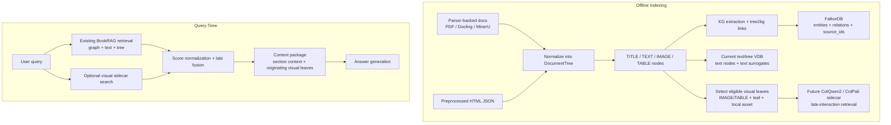

# Local-first visual sidecar retrieval design proposal

## 1. Purpose

This document revises the earlier Gemini-oriented proposal into a **local-first, open-source design** for BookRAG.

The proposed direction is:

- keep **text/tree/graph retrieval** as-is
- add a **local visual sidecar retriever** using **ColQwen2** or **ColPali**
- fuse visual hits with the current BookRAG retrieval stack at query time

The goal is to improve figure-, chart-, diagram-, and table-grounded retrieval while staying aligned with development-phase priorities:

- local deployment
- free/open models
- strong retrieval quality on visually rich documents
- minimal disruption to the current GBC pipeline

## 2. Decision summary

### 2.1 Recommended model family

Use a **document-native visual retriever** as the sidecar retrieval path:

- preferred default: **ColQwen2**
- strong alternative: **ColPali**

These models are a better fit than generic image embedding models because BookRAG retrieves evidence from:

- PDF-derived images
- tables
- charts
- diagrams
- visually rich page content

### 2.2 Why not center the design on Gemini

For the current phase, Gemini is not the right architectural center because the project wants:

- local execution
- open-source models
- no cloud dependency
- low-cost iteration during development

### 2.3 Key architectural consequence

ColQwen2 / ColPali should be added as a **separate retriever path**, not forced into the current single-vector `VectorStore` abstraction.

The main reason is retrieval style:

- current `Core/provider/vdb.py` assumes **one embedding vector per item**
- ColQwen2 / ColPali are best used with **late interaction / multi-vector retrieval**

So this proposal is not just a model swap. It is a **local-first sidecar retrieval architecture**.

## 3. Current implementation constraints

The current codebase already supports multimodal indexing, but in a different retrieval regime:

- `Core/pipelines/vdb_index.py`
  - `process_tree_nodes(...)` separates text nodes and image/table nodes
  - `build_vdb_index(...)` writes both into one vector-store path
- `Core/provider/vdb.py`
  - `VectorStore.add_texts(...)` and `add_images(...)` assume one collection
  - `VectorStore.search(...)` embeds a text query and searches one ANN space
- `Core/rag/gbc_retrieval.py`
  - current fusion is `graph_reranker + text_reranker -> merge_ranker_scores(...) -> calculate_skyline(...)`

This means the existing `VectorStore` works well for GME-style single-vector retrieval, but it is **not the right home for ColQwen2 / ColPali**.

## 4. Proposed architecture

### 4.1 High-level design

Keep the current BookRAG retrieval stack unchanged:

- query planning
- graph reranking
- text reranking
- tree-aware context recovery

Add one new retrieval surface:

- **visual sidecar retriever** for leaf visual evidence

### 4.2 New index to add

Add a new logical index:

- logical name: `visual_leaf_sidecar`

Recommended physical naming:

- `leaf_visual_colqwen2_v1`
- optional alternate benchmark build: `leaf_visual_colpali_v1`

### 4.3 What this index stores

Index only **leaf visual evidence nodes** in phase 1:

- `node.type in {NodeType.IMAGE, NodeType.TABLE}`
- `node.children` is empty
- `node.meta_info.img_path` is present

This keeps the sidecar narrow and high-signal.

### 4.4 What is actually embedded

For ColQwen2 / ColPali, the primary indexed object should be the **visual asset itself**, not a fused text-image vector.

Preferred source for indexing:

1. `img_path` from the leaf node
2. if needed later, a page crop or page image fallback derived from `page_path`

Local text such as:

- `caption`
- `footnote`
- `table_body`
- `content`

should be stored as **metadata and answer context**, not treated as the main retrieval representation in the ColQwen2 / ColPali path.

### 4.5 Why this should not live in the current Chroma collection

The current vector path is optimized for single-vector ANN search. ColQwen2 / ColPali are better used with a retrieval backend that supports or can emulate:

- multi-vector item storage
- late interaction scoring
- separate query and document representations

So the recommended implementation is:

- keep current Chroma path for current BookRAG retrieval
- add a **separate visual retriever store/service** for ColQwen2 / ColPali

### 4.6 Why this should not live in FalkorDB as raw vectors

FalkorDB should store only linkage metadata such as:

- `has_visual_sidecar_embedding`
- `visual_sidecar_model`
- `visual_sidecar_version`
- `visual_sidecar_ref`

Raw late-interaction vectors should stay in the dedicated visual retriever layer.

## 5. Unified indexing and retrieval diagram

The corrected pipeline should treat `DocumentTree` as the canonical internal representation for **all** sources.

That means:

- parser-backed documents still use the current Docling / MinerU extraction flow
- preprocessed HTML JSON bypasses raw parsing and normalizes directly into the tree
- both branches converge before KG extraction, text/tree indexing, and visual leaf selection
- FalkorDB stores graph structure and provenance links such as `source_ids`, not raw embeddings
- text surrogates for image/table leaves stay in the current text/tree retrieval path
- only eligible visual leaves with local assets should feed the future ColQwen2 / ColPali sidecar

### 5.1 Implementation note for this phase

The current implementation work for this branch should stop at the safe integration points:

- add a generic source dispatcher such as `build_tree_from_source(...)`
- add HTML JSON normalization into `DocumentTree`
- preserve current parser-backed tree/KG/VDB behavior
- expose visual-leaf candidate selection hooks for a future sidecar retriever
- write a stub sidecar artifact under `save_path/visual_leaf_sidecar/` containing:
  - `manifest.json`
  - `candidates.json`
  - per-leaf structural/source metadata for future ColQwen2 / ColPali indexing

The actual ColQwen2 / ColPali runtime backend remains a separate follow-up task.

## 6. Query-time fusion design

### 6.1 Retrieval flow

At query time, run two retrieval branches in parallel:

1. **existing BookRAG branch**
   - query planning
   - graph reranking
   - text reranking
2. **visual sidecar branch**
   - encode the text query with ColQwen2 / ColPali query encoder
   - search the visual sidecar index
   - return top-k leaf visual hits

Then fuse the branches before answer packaging.

### 6.2 How visual hits should be expanded

Visual retrieval should return **leaf evidence**, but the final system still needs structured context.

For each visual hit:

1. keep the original visual leaf node as evidence
2. resolve `parent_id`
3. derive the structural path with `DocumentTree.get_path_from_root(node_id)`
4. select a context anchor:
   - preferred: nearest title/section ancestor
   - fallback: direct parent node

This creates two linked layers:

- **evidence layer**: image/table leaf
- **context layer**: parent or section node

### 6.3 Score normalization before fusion

This is more important in the ColQwen2 / ColPali design than it was in the earlier Gemini design.

Reason:

- graph reranker scores
- text reranker scores
- late-interaction visual scores

do not naturally live on the same numeric scale.

Recommended initial policy:

- convert each channel to a normalized `[0, 1]` score over its own top-k result set
- or use rank-based normalization if raw-score calibration is unstable

Only after normalization should the channels be merged.

### 6.4 Preferred BookRAG fusion path

Extend the current `gbc_retrieval.py` logic from two channels to three normalized channels:

- graph reranker score
- text reranker score
- visual sidecar score

Then feed those into the current pattern:

- `merge_ranker_scores(...)`
- `calculate_skyline(...)`

This is the cleanest way to add the new channel without rewriting the full GBC selection logic.

### 6.5 Projection rule from visual leaf to section context

Before fusion:

- the original leaf keeps the full normalized visual score
- the selected context ancestor receives a discounted projected score
- if multiple visual leaves map to the same ancestor, aggregate by max or max-plus-small-bonus

Recommended starting policy:

- leaf node score: `1.0 * s`
- ancestor/context score: `0.8 * s`

### 6.6 Final candidate construction

After fusion:

- deduplicate by `node_id`
- keep the selected context node IDs
- keep the originating visual leaf IDs
- package both into the final answer context

The answer stage should see:

- section/parent text context
- the image/table leaf path
- `caption`, `footnote`, and `table_body` when present

## 7. Metadata to store

### 7.1 Visual sidecar index metadata

Store the following per indexed visual leaf:

- identity
  - `node_id`
  - `parent_id`
  - `pdf_id`
  - `doc_id` if available
  - `tenant_id` if available
- structure
  - `node_type`
  - `depth`
  - `path_from_root_ids`
  - `nearest_title_ancestor_id`
- page/source
  - `page_idx`
  - `page_path`
  - `file_name`
  - `file_path`
- visual asset
  - `img_path`
  - `asset_source = leaf_image | table_image | page_fallback`
- textual context for downstream use
  - `caption`
  - `footnote`
  - `table_body`
  - `content`
- indexing bookkeeping
  - `retriever_family = colqwen2 | colpali`
  - `retriever_model`
  - `retriever_version`
  - `created_at`

These fields are grounded in the current `MetaInfo` structure in `Core/Index/Tree.py`, especially `page_idx`, `page_path`, `pdf_id`, `img_path`, `caption`, `footnote`, `table_body`, and `content`.

### 7.2 Minimal FalkorDB linkage metadata

If the graph layer needs awareness of visual availability, store only lightweight references:

- `node_id`
- `has_visual_sidecar_embedding`
- `visual_sidecar_model`
- `visual_sidecar_version`
- `visual_sidecar_ref`

Do not store the raw late-interaction vectors in FalkorDB.

## 8. Benchmark plan and slices

The benchmark question is now:

> Does a local ColQwen2 / ColPali visual sidecar improve retrieval and QA on visually grounded questions more than the current GME-centric path, without hurting text-only performance?

### 8.1 Systems to compare

Compare at least these variants:

- **A. Current baseline**: existing GME-backed multimodal index only
- **B. Proposed design**: existing retrieval stack + `visual_leaf_sidecar` using ColQwen2
- **C. Alternate build**: existing retrieval stack + `visual_leaf_sidecar` using ColPali
- **D. Optional ablation**: visual sidecar reranking only, no sidecar ANN retrieval

### 8.2 Primary datasets

Use the datasets already aligned with BookRAG:

- `MMLongBench-Doc`
- `M3DocVQA` / `m3docvqa`
- `Qasper` as a text-heavy control dataset

### 8.3 Required benchmark slices

#### Slice 1: explicit figure/table questions

Questions containing cues such as:

- `figure`
- `fig.`
- `table`
- `chart`
- `diagram`
- `plot`
- `image`

#### Slice 2: implicit visual grounding questions

Questions without explicit figure/table language, but whose gold evidence is an `IMAGE` or `TABLE` leaf.

#### Slice 3: table-heavy questions

Subset where correctness depends on:

- row/column lookup
- comparing values
- identifying maxima/minima/trends

#### Slice 4: image/diagram-heavy questions

Subset where correctness depends on:

- chart reading
- diagram interpretation
- figure-caption alignment

#### Slice 5: long-context visual questions

Questions where the right figure/table is not near the most obvious lexical section hit.

#### Slice 6: text-only control

Questions whose gold evidence is text-only.

The local visual sidecar should not materially degrade this slice.

### 8.4 Retrieval metrics

Track at minimum:

- leaf hit rate at `k`
- page hit rate at `k`
- section/context hit rate at `k`
- MRR / nDCG for retrieved evidence
- final answer EM/F1 or task-specific QA score with the same generator held constant

The most important metric is retrieval of the correct **visual evidence node or its containing section**, not only answer quality.

### 8.5 Decision criteria

Adopt the design only if it shows:

- clear gain on figure/table/image slices
- non-trivial gain on long-context visual slices
- stable or improved implicit visual grounding retrieval
- no meaningful regression on text-only control
- acceptable local latency and GPU cost

## 9. Recommended implementation order

1. add a `visual_leaf_sidecar` retrieval module
2. index only leaf `IMAGE` and `TABLE` nodes with `img_path`
3. store local text context as metadata, not as the primary retrieval vector
4. integrate normalized visual scores into `gbc_retrieval.py`
5. benchmark ColQwen2 first, then ColPali as an alternate build

## 10. Final recommendation

The recommended BookRAG design is:

- keep the existing graph/text/tree retrieval stack
- add one **local visual sidecar retriever** using **ColQwen2**
- treat **ColPali** as a strong alternate benchmark build
- fuse visual leaf hits late with current retrieval
- keep raw visual retriever vectors out of FalkorDB and out of the current single-vector Chroma path

This gives BookRAG a higher-upside local retrieval architecture for visually rich documents than a Gemini-centered approach, while staying aligned with development-phase constraints.